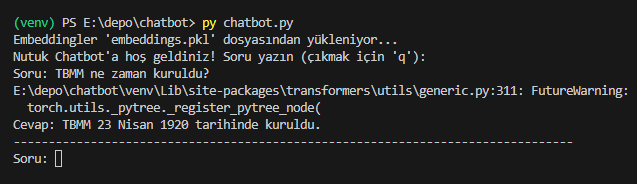

**Nutuk Chatbot**, Mustafa Kemal Atatürk’ün *Nutuk* eserini kaynak alarak sorularınıza cevap veren bir yapay zeka asistanıdır. PDF üzerinden metni işler ve Ollama ile yanıt üretir. 

--- 

## Özellikler 
- Nutuk PDF’ini parçalara ayırır ve embedding oluşturur. 
- Kullanıcının sorusuna en ilgili metin parçalarını seçer. 
- Sorulara kısa ve net cevap verir. 
- Terminal üzerinden kullanılabilir.

 ---

## Proje Dosya Yapısı
nutuk-chatbot/
├── 📄 chatbot.py
├── 📄 README.md
├── 📁 data/
│   └── 📄 nutuk.pdf
├── 📁 screenshots/
│   └── 🖼️ chatbot_soru.PNG  
├── 📄 embeddings.pkl
├── 📄 requirements.txt

 ---

## Kurulum

### 1. GitHub’dan Klonlama
git clone https://github.com/emreates29/mintyfi-repo.git
cd mintyfi-repo/chatbot

### 2. Virtual Environment Oluşturma
python -m venv venv

# Windows
.\venv\Scripts\activate

# Mac/Linux
source venv/bin/activate

### 3. Paketlerin Kurulumu
pip install -r requirements.txt

### 4. Ollama Kurulumu
1. Ollama’yı resmi sitesinden indirin ve yükleyin: https://ollama.com/download  
2. Terminalde çalıştığını doğrulayın:
ollama --help

### 5. PDF Dosyasını Yerleştirme
data/ klasörü altında nutuk.pdf dosyasının bulunduğundan emin olun.

---

### Terminal Üzerinden Çalıştırma

py chatbot.py

- Sorularınızı yazabilirsiniz, örn: "Atatürk Samsun'a ne zaman çıktı?"  
- Çıkmak için: q

Terminal üzerinden chatbot çalışırken ekran görüntüsü:

---

## Örnek Sorular

- TBMM ne zaman kuruldu?
- Sakarya Meydan Muharebesi hangi tarihlerde gerçekleşti?
- Nutuk’ta Erzurum Kongresi’nin önemi nedir?
- Kurtuluş Savaşı nasıl başladı?

---

