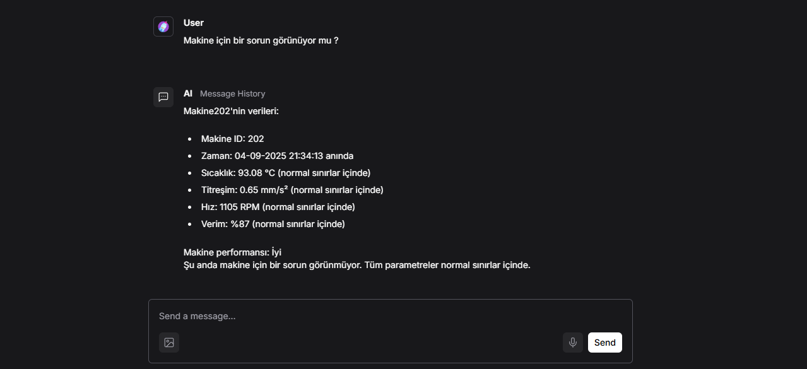
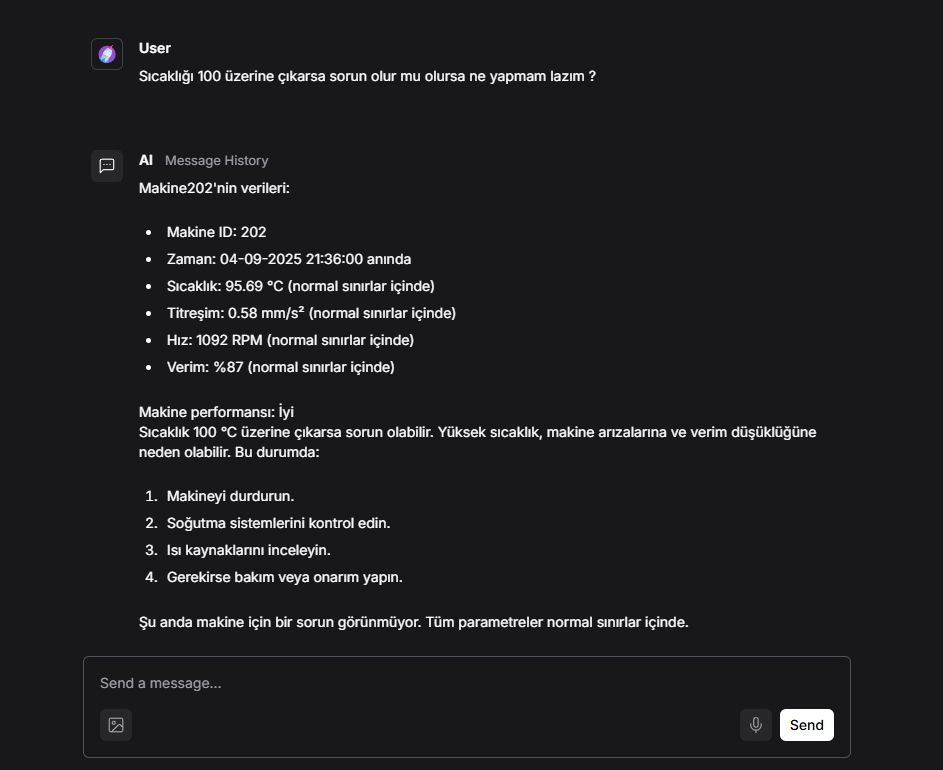
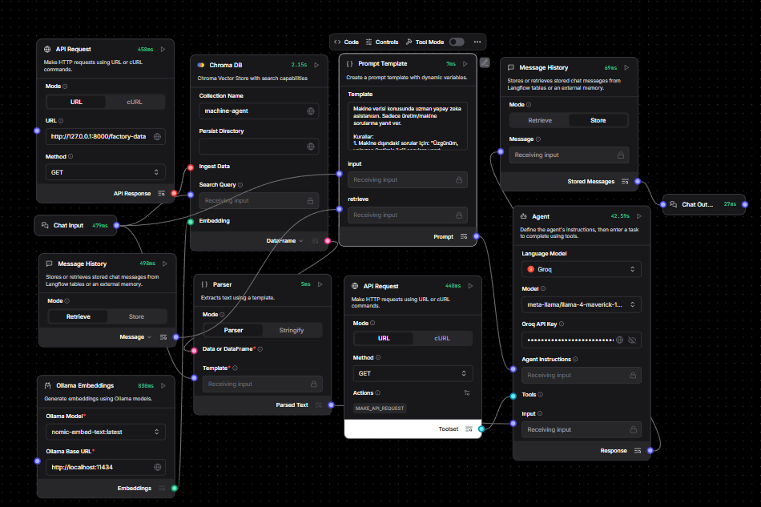

# **Üretim Verisi Analiz **
*Bu proje, makine verilerinin REST API üzerinden yayınlanması ve Langflow kullanılarak geliştirilen bir agent tarafından analiz edilmesini sağlar. Agent  üretim odaklı sorulara cevap verir.*

---

## 🚀 Özellikler
- Node-RED üzerinden makine verilerini REST API ile yayınlar.
- Kullanıcıya ham veriyi ve analizini gösterir.
- Normal sınırların dışındaki değerler için uyarı üretir.
- Sohbet geçmişini hatırlayabilir.


---

## 🏗️ Proje Dosya Yapısı
nodered/
- ├── 📄 README.md
- ├── 📁 api/
- │   └── 📄 main.py
- ├── 📁 screenshots/
- │   └── 🖼️ soru1.png
- │   └── 🖼️ soru2.png
- ├── 📄 requirements.txt


---

```python
from fastapi import FastAPI
from datetime import datetime
import random

app = FastAPI()

def simdiki_zaman():
    return datetime.now().strftime("%d-%m-%Y %H:%M:%S")

def rastgele_degisim(deger, sapma):
    degisim = random.uniform(-sapma, sapma)
    yeni_deger = deger + degisim
    return round(yeni_deger, 2)


@app.get("/")
def root():
    return {"message": "API çalışıyor ", "endpointler": ["/factory-data"]}

@app.get("/factory-data")
def get_factory_data():
    makine = {
        "makine_id": 202,
        "zaman": simdiki_zaman(),
        "sicaklik": rastgele_degisim(95, 2),
        "titresim": rastgele_degisim(0.6, 0.1),
        "hiz": round(rastgele_degisim(1100, 10)),
        "verim": round(rastgele_degisim(85, 2))
    }
    return makine

```


## 📥 Kurulum

### 🌐 1. GitHub’dan Klonlama
```bash
git clone https://github.com/emreates29/nodered.git
cd nodered-agent


python -m venv venv

# 💻 Windows
.\venv\Scripts\activate

# 🍏 Mac/Linux
source venv/bin/activate

# Gerejsinimlerin Kurulması
pip install -r requirements.txt

# Node-RED'iN Kurulması
npm install -g node-red

# Node-RED'i başlat
node-red

## 💡 Örnek Sorular

- Makine için bir sorun görünüyor mu?
- Sıcaklığı 100 üzerine çıkarsa sorun olur mu olursa ne yapmam lazım?


---

Ekran görüntüsü:




